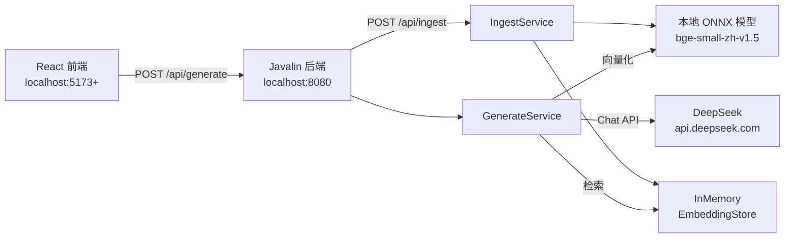
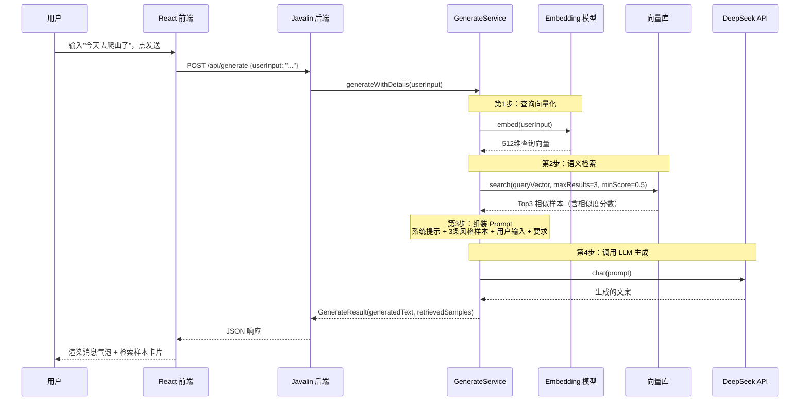

# OnlySay 架构与对话流程分析

> 本文档基于项目真实代码梳理，描述 OnlySay RAG 系统的整体架构、两条核心链路（录入样本 / 对话生成）及关键实现细节。

## 一、整体架构

OnlySay 是一个最小化 RAG（检索增强生成）Demo，后端采用 Java + LangChain4j，前端采用 React + Vite。系统涉及 3 个外部交互点：



### 技术栈

| 层 | 选型 |
|----|------|
| 后端语言 | Java 17+ |
| RAG 框架 | LangChain4j 1.19.0 |
| Web 框架 | Javalin 6.x（轻量 REST API） |
| 向量库 | InMemoryEmbeddingStore（内存，零配置） |
| Embedding | 本地 ONNX 模型 `bge-small-zh-v1.5`（中文优化，512 维） |
| LLM | DeepSeek（OpenAI 兼容 API） |
| 前端 | React + Vite |

### 核心文件对应关系

| 层级 | 文件 | 职责 |
|------|------|------|
| 前端入口 | `frontend/src/App.jsx` | AI 对话界面、HTTP 请求、状态管理 |
| API 层 | `ApiServer.java` | Javalin 路由、CORS、请求/响应处理 |
| 配置层 | `Config.java` | 读取 application.properties + 环境变量 |
| 录入服务 | `IngestService.java` | 样本解析、向量化、存入向量库 |
| 生成服务 | `GenerateService.java` | 查询向量化、语义检索、Prompt 组装、LLM 调用 |

---

## 二、链路 A：录入样本（建索引阶段）

这是 RAG 的「建索引」阶段，把博主风格样本变成可检索的向量。一次性操作，点击前端「录入样本」按钮触发。

### 流程步骤

1. **前端发起请求**（`App.jsx` → `handleIngest()`）

   ```
   fetch POST http://localhost:8080/api/ingest
   ```

2. **后端接收**（`ApiServer.java` → `ingest()`）

   调用 `ingestService.ingestSamples("samples/blogger.md")`

3. **读取并解析样本**（`IngestService.java` → `ingestSamples()`）

   - 读取 `samples/blogger.md` 文件
   - 按 `## 样本` 标题分割成 10 条独立帖子
   - 每条帖子创建为 `TextSegment` 对象

4. **批量向量化**（`embeddingModel.embedAll(segments)`）

   - 调用本地 ONNX 模型 `bge-small-zh-v1.5`
   - 每条文本 → 512 维浮点向量
   - 模型首次运行自动下载到 `~/.djl.ai/`

5. **存入向量库**（`embeddingStore.addAll(embeddings, segments)`）

   - 使用 `InMemoryEmbeddingStore`（内存 Map，重启丢失）
   - 同时保存向量 + 原始文本（用于后续返回详情）

6. **返回前端**

   ```json
   { "success": true, "totalRecords": 10, "message": "样本录入完成" }
   ```

   前端显示「✅ 录入完成，共 10 条样本」

---

## 三、链路 B：对话生成（检索增强生成）⭐ 重点

这是 RAG 的核心阶段，也是用户每次输入消息走的完整流程。

### 时序图



### 逐步详解

#### 第 1 步：用户输入向量化

```java
// GenerateService.java
Embedding queryEmbedding = embeddingModel.embed(userInput).content();
```

- 用户输入的自然语言（如"今天去爬山了"）被转换为 **512 维浮点向量**
- 使用本地 ONNX 模型 `bge-small-zh-v1.5`，中文优化
- 这个向量代表了输入文本的**语义特征**（而非关键词匹配）

#### 第 2 步：向量库语义检索

```java
EmbeddingSearchRequest searchRequest = EmbeddingSearchRequest.builder()
    .queryEmbedding(queryEmbedding)
    .maxResults(3)        // 返回 Top3
    .minScore(0.5)        // 最低相似度阈值
    .build();
EmbeddingSearchResult<TextSegment> searchResult = embeddingStore.search(searchRequest);
```

- 在录入阶段存入的 10 条样本向量中，计算余弦相似度
- 返回最相似的 3 条（相似度通常 0.65~0.85）
- 每条匹配包含：相似度分数 + 原始文本内容

#### 第 3 步：组装 Few-Shot Prompt

```java
private String buildPrompt(String userInput, List<EmbeddingMatch<TextSegment>> matches)
```

组装的 Prompt 结构：

```
你是一位擅长模仿特定博主风格的内容创作助手。

以下是该博主的风格样本，请仔细学习其语气、句式、用词和节奏：

【风格样本 1】
{检索到的最相似样本文本}

【风格样本 2】
{检索到的第二相似样本文本}

【风格样本 3】
{检索到的第三相似样本文本}

现在，请以该博主的风格，围绕以下主题创作一篇自媒体帖子：

【我的事情】
今天去爬山了

要求：
1. 保持博主的语气和风格
2. 内容真实自然，有个人视角
3. 长度 100-300 字
4. 直接输出帖子内容，不要加任何说明
```

> 💡 **RAG 的核心思想就在这里**：不是让 LLM 凭空生成，而是把检索到的相关样本作为「示例」注入 Prompt，让 LLM 模仿博主风格创作。

#### 第 4 步：调用 DeepSeek 生成

```java
String result = chatModel.chat(prompt);
```

- 通过 LangChain4j 的 `OpenAiChatModel`（DeepSeek 兼容 OpenAI 协议）
- 调用 `https://api.deepseek.com/v1/chat/completions`
- 模型：`deepseek-chat`
- 温度：0.7（有一定创意但不发散）
- 返回生成的文案文本

#### 第 5 步：结构化返回前端

```java
return new GenerateResult(result, retrievalDetails);
```

返回 JSON 包含两部分：

```json
{
  "success": true,
  "generatedText": "今天去爬了趟郊外的野山...",
  "retrievedSamples": [
    { "index": 1, "score": 0.7844, "text": "周末去爬了香山..." },
    { "index": 2, "score": 0.6697, "text": "今天写代码写到凌晨..." },
    { "index": 3, "score": 0.6618, "text": "今晚读了《置身事内》..." }
  ]
}
```

#### 第 6 步：前端渲染

- 用户消息 → 右侧紫色气泡
- AI 回复 → 左侧白色气泡（生成的文案）
- 回复下方 → 可展开的检索样本卡片（显示相似度百分比 + 样本原文）
- 加载中 → 打字动画

---

## 四、关键配置项

配置文件位于 `src/main/resources/application.properties`，也可通过环境变量覆盖。

| 配置项 | 默认值 | 作用 |
|--------|--------|------|
| `deepseek.api-key` | - | DeepSeek API Key（优先读取环境变量 `DEEPSEEK_API_KEY`） |
| `deepseek.base-url` | `https://api.deepseek.com/v1` | DeepSeek API 地址 |
| `deepseek.model` | `deepseek-chat` | DeepSeek 对话模型 |
| `retrieval.max-results` | `3` | 每次检索返回几条样本 |
| `retrieval.min-score` | `0.5` | 相似度低于此值则过滤掉 |
| Embedding 模型 | `bge-small-zh-v1.5` | 中文语义向量模型，512 维 |
| Temperature | `0.7` | 生成创意度（构造在 GenerateService 中） |

---

## 五、API 接口说明

| 方法 | 端点 | 请求体 | 响应 |
|------|------|--------|------|
| GET | `/api/health` | 无 | `{ "status": "ok" }` |
| POST | `/api/ingest` | 无 | `{ "success": true, "totalRecords": 10 }` |
| POST | `/api/generate` | `{ "userInput": "今天去爬山了" }` | `{ "success": true, "generatedText": "...", "retrievedSamples": [...] }` |

---

## 六、当前 MVP 局限性与后续方向

| 局限 | 说明 | 后续方向 |
|------|------|----------|
| 向量库内存存储 | 重启服务后数据丢失，需重新录入 | 切换到持久化向量库（如 Chroma、PGVector） |
| 非流式输出 | 每次要等 DeepSeek 完整生成后才返回，等待 5-15 秒 | 改为 SSE 流式输出，逐字展示 |
| 无会话记忆 | 每次对话独立，不保存历史上下文 | 增加会话管理，支持多轮对话 |
| 样本固定 | 只能录入 `samples/blogger.md` | 支持前端动态添加样本 |
| 单博主风格 | 只支持一种博主风格 | 支持多博主风格切换 |
