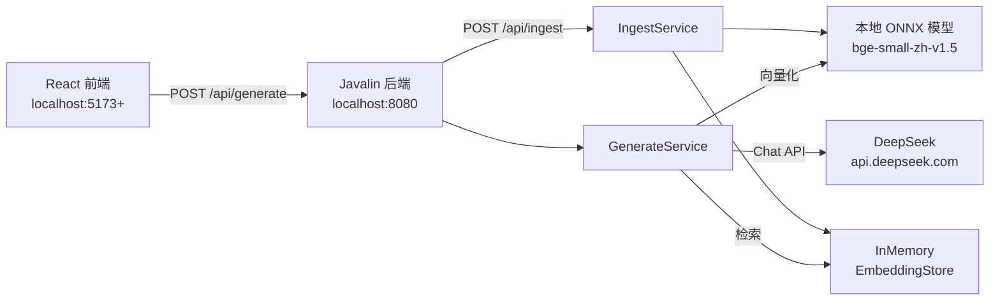
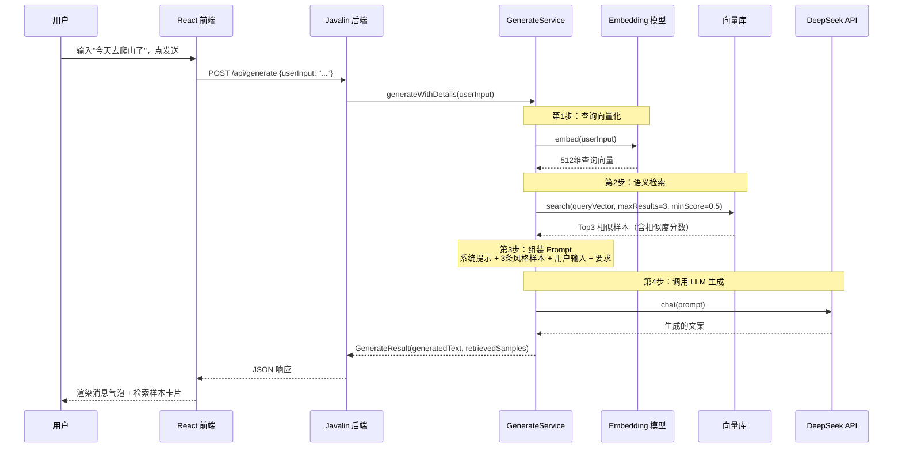
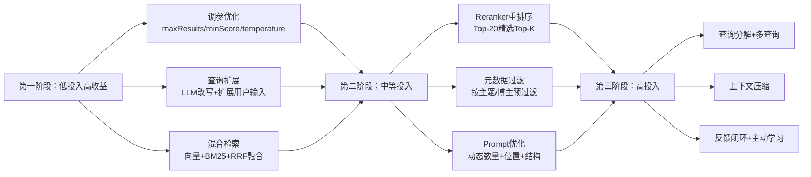

# OnlySay 架构与对话流程分析

> 本文档基于项目真实代码梳理，描述 OnlySay RAG 系统的整体架构、两条核心链路（录入样本 / 对话生成）及关键实现细节。

## 一、整体架构

OnlySay 是一个最小化 RAG（检索增强生成）Demo，后端采用 Java + LangChain4j，前端采用 React + Vite。系统涉及 3 个外部交互点：



### 技术栈

| 层 | 选型 |
|----|------|
| 后端语言 | Java 17+ |
| RAG 框架 | LangChain4j 1.19.0 |
| Web 框架 | Javalin 6.x（轻量 REST API） |
| 向量库 | InMemoryEmbeddingStore（内存，零配置） |
| Embedding | 本地 ONNX 模型 `bge-small-zh-v1.5`（中文优化，512 维） |
| LLM | DeepSeek（OpenAI 兼容 API） |
| 前端 | React + Vite |

### 核心文件对应关系

| 层级 | 文件 | 职责 |
|------|------|------|
| 前端入口 | `frontend/src/App.jsx` | AI 对话界面、HTTP 请求、状态管理 |
| API 层 | `ApiServer.java` | Javalin 路由、CORS、请求/响应处理 |
| 配置层 | `Config.java` | 读取 application.properties + 环境变量 |
| 录入服务 | `IngestService.java` | 样本解析、向量化、存入向量库 |
| 生成服务 | `GenerateService.java` | 查询向量化、语义检索、Prompt 组装、LLM 调用 |

---

## 二、链路 A：录入样本（建索引阶段）

这是 RAG 的「建索引」阶段，把博主风格样本变成可检索的向量。一次性操作，点击前端「录入样本」按钮触发。

### 流程步骤

1. **前端发起请求**（`App.jsx` → `handleIngest()`）

   ```
   fetch POST http://localhost:8080/api/ingest
   ```

2. **后端接收**（`ApiServer.java` → `ingest()`）

   调用 `ingestService.ingestSamples("samples/blogger.md")`

3. **读取并解析样本**（`IngestService.java` → `ingestSamples()`）

   - 读取 `samples/blogger.md` 文件
   - 按 `## 样本` 标题分割成 10 条独立帖子
   - 每条帖子创建为 `TextSegment` 对象

4. **批量向量化**（`embeddingModel.embedAll(segments)`）

   - 调用本地 ONNX 模型 `bge-small-zh-v1.5`
   - 每条文本 → 512 维浮点向量
   - 模型首次运行自动下载到 `~/.djl.ai/`

5. **存入向量库**（`embeddingStore.addAll(embeddings, segments)`）

   - 使用 `InMemoryEmbeddingStore`（内存 Map，重启丢失）
   - 同时保存向量 + 原始文本（用于后续返回详情）

6. **返回前端**

   ```json
   { "success": true, "totalRecords": 10, "message": "样本录入完成" }
   ```

   前端显示「✅ 录入完成，共 10 条样本」

---

## 三、链路 B：对话生成（检索增强生成）⭐ 重点

这是 RAG 的核心阶段，也是用户每次输入消息走的完整流程。

### 时序图



### 逐步详解

#### 第 1 步：用户输入向量化

```java
// GenerateService.java
Embedding queryEmbedding = embeddingModel.embed(userInput).content();
```

- 用户输入的自然语言（如"今天去爬山了"）被转换为 **512 维浮点向量**
- 使用本地 ONNX 模型 `bge-small-zh-v1.5`，中文优化
- 这个向量代表了输入文本的**语义特征**（而非关键词匹配）

#### 第 2 步：向量库语义检索

```java
EmbeddingSearchRequest searchRequest = EmbeddingSearchRequest.builder()
    .queryEmbedding(queryEmbedding)
    .maxResults(3)        // 返回 Top3
    .minScore(0.5)        // 最低相似度阈值
    .build();
EmbeddingSearchResult<TextSegment> searchResult = embeddingStore.search(searchRequest);
```

- 在录入阶段存入的 10 条样本向量中，计算余弦相似度
- 返回最相似的 3 条（相似度通常 0.65~0.85）
- 每条匹配包含：相似度分数 + 原始文本内容

#### 第 3 步：组装 Few-Shot Prompt

```java
private String buildPrompt(String userInput, List<EmbeddingMatch<TextSegment>> matches)
```

组装的 Prompt 结构：

```
你是一位擅长模仿特定博主风格的内容创作助手。

以下是该博主的风格样本，请仔细学习其语气、句式、用词和节奏：

【风格样本 1】
{检索到的最相似样本文本}

【风格样本 2】
{检索到的第二相似样本文本}

【风格样本 3】
{检索到的第三相似样本文本}

现在，请以该博主的风格，围绕以下主题创作一篇自媒体帖子：

【我的事情】
今天去爬山了

要求：
1. 保持博主的语气和风格
2. 内容真实自然，有个人视角
3. 长度 100-300 字
4. 直接输出帖子内容，不要加任何说明
```

> 💡 **RAG 的核心思想就在这里**：不是让 LLM 凭空生成，而是把检索到的相关样本作为「示例」注入 Prompt，让 LLM 模仿博主风格创作。

#### 第 4 步：调用 DeepSeek 生成

```java
String result = chatModel.chat(prompt);
```

- 通过 LangChain4j 的 `OpenAiChatModel`（DeepSeek 兼容 OpenAI 协议）
- 调用 `https://api.deepseek.com/v1/chat/completions`
- 模型：`deepseek-chat`
- 温度：0.7（有一定创意但不发散）
- 返回生成的文案文本

#### 第 5 步：结构化返回前端

```java
return new GenerateResult(result, retrievalDetails);
```

返回 JSON 包含两部分：

```json
{
  "success": true,
  "generatedText": "今天去爬了趟郊外的野山...",
  "retrievedSamples": [
    { "index": 1, "score": 0.7844, "text": "周末去爬了香山..." },
    { "index": 2, "score": 0.6697, "text": "今天写代码写到凌晨..." },
    { "index": 3, "score": 0.6618, "text": "今晚读了《置身事内》..." }
  ]
}
```

#### 第 6 步：前端渲染

- 用户消息 → 右侧紫色气泡
- AI 回复 → 左侧白色气泡（生成的文案）
- 回复下方 → 可展开的检索样本卡片（显示相似度百分比 + 样本原文）
- 加载中 → 打字动画

---

## 四、关键配置项

配置文件位于 `src/main/resources/application.properties`，也可通过环境变量覆盖。

| 配置项 | 默认值 | 作用 |
|--------|--------|------|
| `deepseek.api-key` | - | DeepSeek API Key（优先读取环境变量 `DEEPSEEK_API_KEY`） |
| `deepseek.base-url` | `https://api.deepseek.com/v1` | DeepSeek API 地址 |
| `deepseek.model` | `deepseek-chat` | DeepSeek 对话模型 |
| `retrieval.max-results` | `3` | 每次检索返回几条样本 |
| `retrieval.min-score` | `0.5` | 相似度低于此值则过滤掉 |
| Embedding 模型 | `bge-small-zh-v1.5` | 中文语义向量模型，512 维 |
| Temperature | `0.7` | 生成创意度（构造在 GenerateService 中） |

---

## 五、API 接口说明

| 方法 | 端点 | 请求体 | 响应 |
|------|------|--------|------|
| GET | `/api/health` | 无 | `{ "status": "ok" }` |
| POST | `/api/ingest` | 无 | `{ "success": true, "totalRecords": 10 }` |
| POST | `/api/generate` | `{ "userInput": "今天去爬山了" }` | `{ "success": true, "generatedText": "...", "retrievedSamples": [...] }` |

---

## 六、当前 MVP 局限性与后续方向

| 局限 | 说明 | 后续方向 |
|------|------|----------|
| 向量库内存存储 | 重启服务后数据丢失，需重新录入 | 切换到持久化向量库（如 Chroma、PGVector） |
| 非流式输出 | 每次要等 DeepSeek 完整生成后才返回，等待 5-15 秒 | 改为 SSE 流式输出，逐字展示 |
| 无会话记忆 | 每次对话独立，不保存历史上下文 | 增加会话管理，支持多轮对话 |
| 样本固定 | 只能录入 `samples/blogger.md` | 支持前端动态添加样本 |
| 单博主风格 | 只支持一种博主风格 | 支持多博主风格切换 |

---

## 七、各环节检索准确性优化手段

> 针对链路 B（对话生成）的每个环节，列出可优化「检索准确性」的手段。按 RAG 管线阶段组织，每阶段区分 🟢 **MVP 快速可做**（改动小、收益明确）和 🔵 **进阶方向**（需要更多工程投入）。

### 环节 1：样本录入（建索引阶段）

**问题背景**：当前录入只是把整条帖子文本向量化，未做分块和元数据增强，导致检索粒度粗、缺少结构化上下文。

| 手段 | 类型 | 说明 |
|------|------|------|
| **语义分块（Chunking）** | 🟢 | 将长样本按语义段落拆成 200-400 字的块，每个块独立向量化。检索到的片段更精准，避免"相关内容被无关内容稀释" |
| **元数据增强** | 🟢 | 为每个样本块附加结构化字段（来源博主、主题标签、创作时间、情绪标签等），检索时可按元数据过滤（如只检索"美食"主题的样本） |
| **样本清洗与去重** | 🟢 | 录入前去除重复样本、无效内容（广告、口水话），提升整体语料质量 |
| **HyDE 预处理** | 🔵 | 为每条样本生成一个"假设问题"或"摘要"，用问题/摘要的向量代替原文向量。研究表明 HyDE 可提升稀疏语料场景下的检索效果 |
| **多粒度索引** | 🔵 | 同时建立句子级、段落级、文档级三层索引，检索时先粗后细，兼顾召回率与精度 |

### 环节 2：查询理解（用户输入向量化）

**问题背景**：当前直接对用户原始输入做 embedding，没有对查询做任何改写或扩展，短查询和口语化输入容易检索不准。

| 手段 | 类型 | 说明 |
|------|------|------|
| **查询扩展（Query Expansion）** | 🟢 | 用 LLM 将用户短输入扩展为更丰富的描述。例如"今天爬山了"→"今天去郊外爬山，欣赏自然风光，锻炼身体，感受户外的宁静与治愈"，增加语义覆盖面 |
| **查询重写（Query Rewriting）** | 🟢 | 将口语化输入改写为更适合检索的书面表达。例如"今天好开心啊吃了火锅"→"今天和朋友吃火锅感到很开心"，消除语气词和口水话干扰 |
| **HyDE 查询** | 🔵 | 先用 LLM 根据用户输入生成一段"假设的博主风格回复"，再用这段生成文本的向量去检索。绕过"用户口语表达"与"博主书面风格"之间的语义鸿沟 |
| **多查询生成（Multi-Query）** | 🔵 | 用 LLM 生成 3-5 个不同角度的查询变体，分别检索后合并结果。提升召回率，覆盖用户意图的多种表达方式 |
| **查询分解** | 🔵 | 复杂查询拆解为多个子查询，分别检索后融合。例如"推荐一个适合周末带孩子的户外地点"→拆解为"周末户外活动" + "适合儿童的地点" |

### 环节 3：语义检索（向量库匹配）⭐ 核心优化点

**问题背景**：当前仅用单一向量检索（`maxResults=3, minScore=0.5`），存在"语义相似但关键词不匹配"或"关键词匹配但语义不符"的盲区。

| 手段 | 类型 | 说明 |
|------|------|------|
| **调优检索参数** | 🟢 | 适当增大 `maxResults` 到 5-10（增加候选池），配合 Reranker 精选；`minScore` 不宜过低（低于 0.4 会引入噪声），也不宜过高（高于 0.7 会漏掉相关结果） |
| **混合检索（向量 + BM25）** | 🟢 | 同时用向量检索（语义）和 BM25（关键词），两路结果合并。**注意：必须做分数对齐**（min-max 归一化），不能直接混合不同尺度的分数排序，否则会误选 |
| **RRF 融合** | 🟢 | 用 Reciprocal Rank Fusion 融合多路检索结果，公式 `score = Σ 1/(k + rank)`（k 通常为 60）。RRF 不依赖原始分数尺度，比加权求和更鲁棒 |
| **元数据预过滤** | 🟢 | 检索前先按元数据（主题、博主）过滤候选集，再在子集内做向量检索，提升精度 |
| **Reranker 重排序** | 🔵 | 召回 Top-20 后，用专门的 Cross-Encoder 重排序模型（如 `bge-reranker-v2-m3`）对候选重新打分，取 Top-K。Reranker 比向量相似度精确 10-30%，是 RAG 提升精度最有效的手段之一 |
| **父文档检索（Parent Document Retriever）** | 🔵 | 小块检索（精确匹配），但返回时将小块对应的父段落一起返回。兼顾检索精度和上下文完整性 |
| **多向量表示** | 🔵 | 同一样本用多种方式编码（原文 + 摘要 + 关键词标签），检索时分别匹配并综合得分 |

> ⚠️ **经验教训**：混合检索时，向量相似度（余弦距离 0~1）和 BM25 分数（无界、长尾分布）**尺度完全不同**，直接相加会被 BM25 主导。必须归一化后再加权，或用 RRF 这类基于排名的融合方法。

### 环节 4：Prompt 组装（上下文组织）

**问题背景**：当前 Prompt 固定取 Top-3 检索结果，没有根据相关性动态调整数量，也没有对检索结果做质量筛选。

| 手段 | 类型 | 说明 |
|------|------|------|
| **动态上下文数量** | 🟢 | 根据检索结果的相似度分布动态决定注入条数。如果 Top-1 相似度 0.9 以上，可能 1 条就够；如果都在 0.5 左右，多取几条覆盖更多风格 |
| **相关性过滤** | 🟢 | 对检索结果做二次相关性判断（可用小模型或规则），过滤掉"语义相似但主题不符"的样本，不注入 Prompt |
| **Prompt 位置优化** | 🟢 | 最重要的风格样本放在 Prompt 开头和结尾（LLM 对首尾内容更敏感，Lost-in-the-Middle 效应） |
| **结构化 Prompt 模板** | 🟢 | 用清晰的分隔符和角色标签组织 Prompt（如 XML 标签 `<style_examples>...</style_examples>`），提升 LLM 对结构的解析能力 |
| **上下文压缩（Contextual Compression）** | 🔵 | 用 LLM 对检索到的样本做摘要压缩，保留风格特征、去除冗余，在有限上下文窗口内注入更多有用信息 |
| **自我查询（Self-Querying）** | 🔵 | 让 LLM 先生成结构化查询（含过滤器），再用结构化查询检索，过滤更精准 |
| **ReAct / 工具增强** | 🔵 | 让 LLM 具备"按需检索"能力：生成过程中如果发现风格不够，主动发起二次检索 |

### 环节 5：LLM 生成（最终输出）

**问题背景**：当前 temperature=0.7 固定，没有针对风格模仿任务专门优化生成参数和 system prompt。

| 手段 | 类型 | 说明 |
|------|------|------|
| **调优生成参数** | 🟢 | 风格模仿任务建议降低 temperature 到 0.3-0.5（减少发散，更贴近样本风格）；同时设置 `top_p=0.9`、`presence_penalty`/`frequency_penalty` 控制重复 |
| **强化 System Prompt** | 🟢 | 在 system prompt 中明确风格约束："严格模仿提供的风格样本的句式、用词、语气，不要使用样本中没有的表达风格" |
| **负面约束提示** | 🟢 | 明确告诉 LLM 不要做什么："不要使用过于正式的书面语，不要使用'首先/其次'这类结构化表达" |
| **少样本质量提升** | 🟢 | 确保注入的 few-shot 样本确实是高质量的博主风格代表，垃圾 in-context examples 会严重误导生成 |
| **多轮自评估** | 🔵 | 生成后让 LLM 自评"是否符合博主风格"，不满意则重新生成（Reflexion 模式） |
| **风格一致性检查** | 🔵 | 用风格分类模型检测生成内容与目标博主风格的一致性，不一致则回退或调整 |
| **DPO / SFT 微调** | 🔵 | 用博主风格数据对 LLM 做微调，从模型层面内化风格（成本高，但效果最根本） |

### 环节 6：后处理与反馈闭环

**问题背景**：当前生成结果直接返回前端，没有质量校验和用户反馈机制，无法持续优化。

| 手段 | 类型 | 说明 |
|------|------|------|
| **置信度展示** | 🟢 | 根据检索相似度和生成一致性，给结果打"风格匹配度"分数，让用户知情（如"风格匹配度: 85%"） |
| **人工反馈收集** | 🟢 | 前端增加👍/👎按钮，用户反馈差的结果记录下来，用于后续分析和优化 |
| **事实/风格核查** | 🔵 | 生成后用 LLM 做二次核查："这段文案是否真的模仿了提供的风格样本？"，不符合则标记或重新生成 |
| **A/B 测试框架** | 🔵 | 支持不同检索策略/Prompt 模板的灰度对比，用实际效果数据驱动优化 |
| **检索日志分析** | 🔵 | 记录每次检索的 query、命中样本、相似度、用户反馈，定期分析 bad case 反哺优化 |
| **主动学习** | 🔵 | 从用户反馈中挖掘训练数据，持续迭代 Embedding 模型和 Reranker |

### 优化优先级建议



**建议路径**：先做第一阶段的 3 项（调参 + 查询扩展 + 混合检索），改动量小但通常能带来 20-40% 的检索准确率提升；如果效果仍不满足，再上 Reranker（第二阶段），这是工业界 RAG 提升精度最有效的单一手段。
